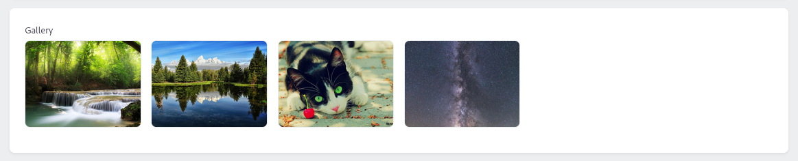

Gallery представляет из себя сетку неинтерактивных изображений - вы не можете кликнуть по ним, чтобы увеличить (для этого используется компонент [Lightbox](/orchid-image-components/usage/lightbox)).



## Использование

### Отношения с моделью

Может быть определено таким же образом, как и любое поле Orchid.

```php
// app/Models/Post.php

class Post extends Model
{
    use Attachable;

    public function thumb(): HasOne
    {
        return $this->hasOne(Attachment::class, 'id', 'thumb_id');
    }

    public function gallery(): MorphToMany
    {
        return $this->attachment(
            'post_gallery_group' // группа
        );
    }
}
```

```php
use Czernika\OrchidImages\Screen\Components\Gallery;

Gallery::make('post.gallery'),
```

Галерею можно создать через отношение один к одному (хотя это и не имеет смысла в большинстве случаев - используйте вместо этого [Image](/orchid-image-components/usage/image)).

```php
Gallery::make('post.thumb'),
```

### Передать массив ссылок

Можно передать картинки для отображения вручную - подробнее в секции [элементы](#elements)

## Опции

### Колонки

Количество колонок в сетке.

```php
Gallery::make()
    ->columns(4),
```

**По-умолчанию** 6 колонок. Количество колонок в таком случае не будет меняться на мобильном устройстве. Если такое поведение вас не устраивает, используйте вместо этого метод `autoFit()`. Данный метод основан на значении `auto-fit` CSS Grid для свойства `grid-template-columns`.

```php
Gallery::make()
    ->autoFit(200), // 200px
```

Данная запись эквивалентна `grid-template-columns: repeat(auto-fit, minmax(200px, 1fr))`


Выглядит она так же на скриншоте, как если бы использовали 4 колонки, но если четвертой картинке не хватит места (она должна быть как минимум 200 пикселей в ширину), то она перепрыгнет на следующий ряд, а сетка будет иметь вид трех колонок. Если же в коллекции меньше двух изображений, `auto-fit` будет заменен на `auto-fill`, чтобы предотвратить чрезмерное растяжение картинки.

### Соотношение сторон

Соотношение сторон для каждого элемента галереи. По-умолчанию `auto`, что означает, что изображение будет занимать столько места, сколько ему нужно 

### Вписываемость

Применяется для каждого изображения в галерее. Смотрите [fit для Image](/orchid-image-components/usage/image#fit-property).

### Пустое значение

Если же картинок в галерее нет, вы можете указать, что показывать вместо этого.

```php
Gallery::make()
    ->empty('No gallery'),
```

Данный метод принимает HTML.

```php
Gallery::make()
    ->empty('<b>No gallery</b>'),
```

Или даже другой компонент

```php
Gallery::make()
    ->empty(Image::make()->src(asset('/img/placeholder.jpg')))
```

### Элементы

Можно передать значения различными способами.

- как модель

```php
Gallery::make()
    ->elements($attachment),
```

- коллекция или массив моделей
    
```php
Gallery::make()
    ->elements([$attachment1, $attachment2, ...]),
```

- из отношения

```php
Gallery::make()
    ->elements($post->gallery),
```

- из результата запроса

```php
Gallery::make()
    ->elements(Attachment::where(...)->get()),
```

- передать массив ссылок

```php

Gallery::make()
    ->elements(['https://some.external/img.jpg', asset('/img/local-img.jpg')]),
```

В таком случае, атрибуты `alt` и `title` будут пустыми. Если же вам они нужны, используйте массив ассоциативных массивов с ключами `url`, `alt` и `title`.

:::caution
Только ключ **url** необходим в таком случае.
::: 

```php
Gallery::make()
    ->elements([
        ['url' => 'https://some.path.to/img.jpg', 'alt' => 'Some alt', 'title' => 'Some title'],
        ['url' => asset('/img/local-img.jpg'), 'alt' => 'Some alt 2', 'title' => 'Some title 2'],
        ...
    ]),
```

### Максимальная ширина галереи

Задайте ширину для всей галереи

```php
Gallery::make()
    ->width(500)
```
