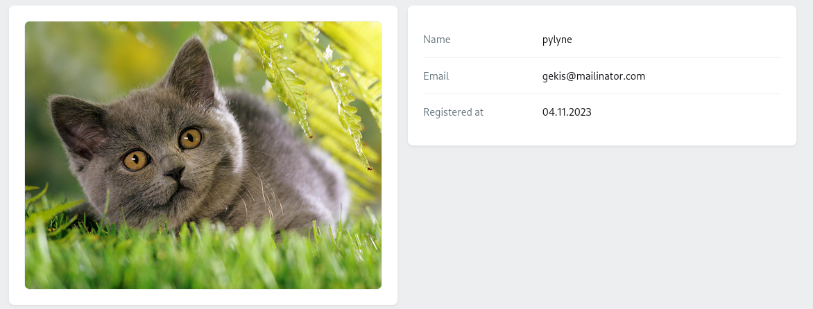
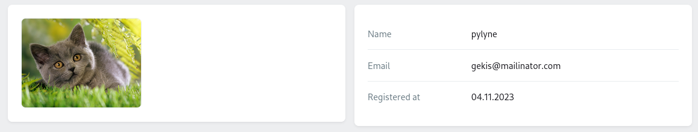
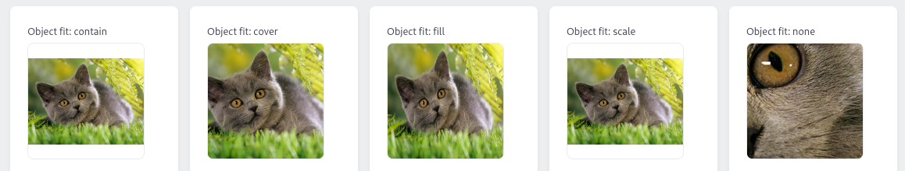
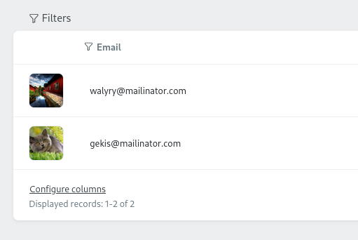
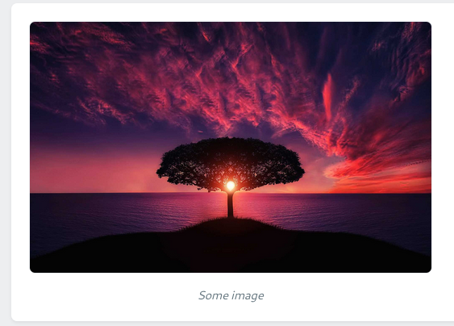

## Использование

### Вместе с моделью

Подразумеваем, что у вас есть колонка `avatar_id` в таблице пользователей, которая хранит ID вложения, и определено отношение для нее.

```php
// app/Models/User.php

public function avatar()
{
    return $this->hasOne(Attachment::class, 'id', 'avatar_id');
}
```

Чтобы показать прикрепленное вложение, нужно передать "путь" до него как ключ в метод фабрики `make()`.

```php
// app/Orchid/Screens/UserShowScreen.php
use Czernika\OrchidImages\Screen\Components\Image;

public function query(User $user)
{
    return [
        'user' => $user,
    ];
}

public function layout()
{
    Layout::columns([
        Layout::rows([
            Image::make('user.avatar'), // Здесь
        ]),

        // Эта часть неважна и нужна лишь для отображения содержимого скриншота
        Layout::legend('user', [
            Sight::make('name'),
            Sight::make('email'),
            Sight::make('created_at', 'Registered at')
                ->render(fn (User $user) => $user->created_at->format('d.m.Y')),
        ])
    ]),
}
```

Или же можно передать просто название колонки, которая хранит ID

```php
Image::make('user.avatar_id'),
```



Если же вы храните ссылку на изображение в базе, ничего не меняется

```php
Image::make('user.avatar_url'),
```

### Передать ссылку на изображение

Можно передать ссылку на изображение в метод `src()` - подробнее [здесь](#src).

## Опции

Набор полезных методов для управления свойствами изображения.

### Размеры

Вы можете указать высоту и ширину изображения по желанию. По-умолчанию, изображение занимает все свободное пространство по ширине, сохраняя пропорции 

```php
Image::make('user.avatar')
    ->width(200) // 200px
    ->height(150), // 150px
```



Метод может принимать не только числа, но и любые валидные CSS значения в виде строки.

```php
Image::make('user.avatar')
    ->width('20vw'),
```

**Значения по-умолчанию** для ширины `100%` и `auto` для высоты.

Если вам нужно квадратное изображение, легче будет передать лишь одно значение через метод `size()`.

```php
Image::make('user.avatar')
    ->size(200), // отобразит изображение размером 200x200 пикселей
```

### Alt

Alt представляет из себя простое отображение атрибута alt изображения.

:::note
Данная зависимость попытается узнать alt у модели, которая прикреплена к компоненту. В данном примере, если изображение аватара в базе хранит значение alt, это значение и будет использовано. Конечно же, вы вольны изменять это поведение.
:::

Чтобы изменить или назначить alt, передайте значение в метод `alt()`.

```php
Image::make('user.avatar')
    ->alt('User avatar')
```

### Вписываемость

Представляет из себя CSS свойство [object-fit](https://developer.mozilla.org/en-US/docs/Web/CSS/object-fit) и принимает значения в стиле [Bootstrap](https://getbootstrap.com/docs/5.3/utilities/object-fit/).

Принимает одно из 5 значений: `contain`, `cover`, `fill`, `scale` (для scale-down), или `none`.

```php
Image::make('user.avatar')
    ->size(250)
    ->objectFit('contain'),
```



Также можно использовать перечисление `ObjectFit`.

```php
use Czernika\OrchidImages\Enums\ObjectFit;

Image::make('user.avatar')
    ->size(250)
    ->objectFit(ObjectFit::CONTAIN), // то же самое, что и 'contain'
```

### Плейсхолдер

Пока что мы работали с пользователями, у которых есть аватар. Но что, если его нет?

Для таких случаев можно использовать плейсхолдер - дефолтное изображение. Метод принимает путь до изображения, которое будет показываться вместо аватара пользователя, если его нет или файл был поврежден (не существует на диске).

```php
Image::make('user.avatar')
    ->placeholder(asset('/img/no-avatar.jpg')),
```

В данном случае `no-avatar.jpg` будет показана, если у пользователя нет аватара.

### Источник

Также можно передать значение напрямую в метод `src()`. Это может быть полезным для отображения изображений "извне" или показа их в таблице, где передать ключ не получится.

```php
TD::make()
    ->render(fn (User $user) =>
        Image::make()
            ->size(50)
            ->src($user->avatar->url()) // передайте путь до изображения
    )
```



Метод может принимать не только строковые значения, но и модель Attachment.

```php
Image::make()
    ->src($user->avatar),

Image::make()
    ->src(Attachment::find($user->avatar_id)),
```

### Соотношение

:::caution
In development
:::

### Заголовок

Используйте, когда нужно добавить описание изображению

```php
Image::make()
    ->src('https://domain.com/some-image.jpg')
    ->width(500)
    ->caption('Some image'),
```


