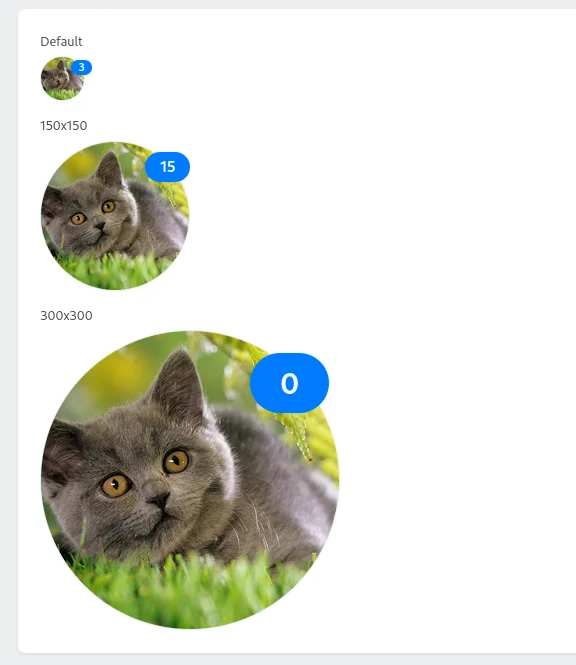
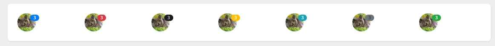

## Usage

The Avatar component is very similar to [Image](/usage/image). It represents a completely round image and ignores the `fit()` property; other than that, every other method is valid.

```php
use Czernika\OrchidImages\Screen\Components\Avatar;

Avatar::make('user.avatar')
    ->size(200)
    ->placeholder(asset('/img/no-avatar.jpg')),
```

**Default** avatar size is 3rem.

## Options

:::note
Most of them are the same as for [Image](/usage/image#options).
:::

### Alt

See [alt for Image](/usage/image#alt).

### Size

See [size for Image](/usage/image#sizes).

### Placeholder

See [placeholder Image](/usage/image#placeholder).

### Src

See [src for Image](/usage/image#src).

### Badge

Avatar may have a badge - a little icon in the top corner. It changes its size according to the avatar's.



To pass a value, simply use the `badge()` method.

```php
Avatar::make('user.avatar')
    ->badge(15),
```

It is also possible to use the callback function, although the value of such approach is debatable.

```php
Avatar::make('user.avatar')
    ->badge(fn () => 15),

Avatar::make('user.avatar')
    ->badge(fn ($repository) => 15),
```

As a parameter it can accept either the Attachment model, or a string value, or even `null`, depending on what you've passed (or not) into the Avatar component.

If you need to hide the badge with some values (for example, 0), pass `false` as the value.

```php
Avatar::make('user.avatar')
    ->badge(fn () => $user->hasNotifications() ? $user->notifications_count : false),
```

### Badge color (type)

You may change the badge color scheme according to the Orchid color scheme using `Orchid\Support\Color` enum; just pass it into the `badgeType()` method.

```php
Avatar::make('user.avatar')
    ->badge(3)
    ->badgeType(Color::DANGER),
```



### Gallery max width

:::caution
In development
:::
