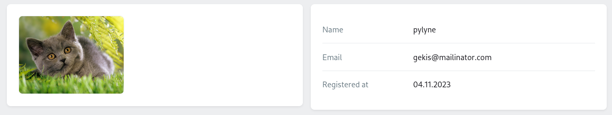
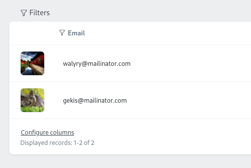
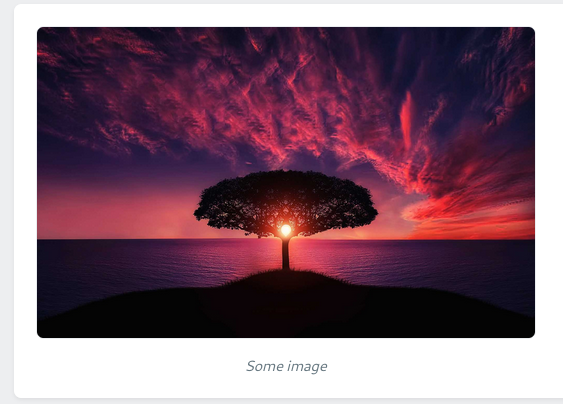

## Usage

### From the Model

Assuming you have the `avatar_id` column in your users table, which stores attachment ID and relation for it.

```php
// app/Models/User.php

public function avatar()
{
    return $this->hasOne(Attachment::class, 'id', 'avatar_id');
}
```

In order to show the attached image, you just need to pass the relation "path" as a key into the `make()` field factory method.

```php
// app/Orchid/Screens/UserShowScreen.php
use Czernika\OrchidImages\Screen\Components\Image;

public function query(User $user)
{
    return [
        'user' => $user,
    ];
}

public function layout()
{
    Layout::columns([
        Layout::rows([
            Image::make('user.avatar'), // Here is the "path" key
        ]),

        // This part is irrelevant just to show screenshot content
        Layout::legend('user', [
            Sight::make('name'),
            Sight::make('email'),
            Sight::make('created_at', 'Registered at')
                ->render(fn (User $user) => $user->created_at->format('d.m.Y')),
        ])
    ]),
}
```

You can pass the column name, which stores the Attachment ID.

```php
Image::make('user.avatar_id'),
```


If you store URL in database it still is valid option.

```php
Image::make('user.avatar_url'),
```

### External image

A path to an image can be passed directly to a `src()` method; more details can be found [here](#src).

## Options

Set of useful methods to control images.

### Sizes

You can specify both image width and height if you wish. By default, the image stretches over the entire available space and keeps its proportions.

```php
Image::make('user.avatar')
    ->width(200) // 200px
    ->height(150), // 150px
```



It can accept not only `integer` values, but any valid CSS property as a `string`.

```php
Image::make('user.avatar')
    ->width('20vw'),
```

**Default values** for width are `100%` and `auto` for height.

If you wish to make a square image, you may pass both width and height as one property using the `size()` method.

```php
Image::make('user.avatar')
    ->size(200), // will show image 200x200 pixels
```

### Alt

The alt property simply represents the image alt attribute.

:::note
Package will try to define the image alt attribute from the attached entry. In this example, if an avatar's attachment has a stored alt value in the database, this value will be used. However, you are free to change it.
:::

In order to change the alt attribute of the image, just pass the value into the `alt()` method.

```php
Image::make('user.avatar')
    ->alt('User avatar')
```

### Fit property

It represents the CSS [object-fit property](https://developer.mozilla.org/en-US/docs/Web/CSS/object-fit) and accepts values in a [Bootstrap way](https://getbootstrap.com/docs/5.3/utilities/object-fit/).

Accepts one of these 5 values: `contain`, `cover`, `fill`, `scale` (for scale-down), or `none`.

```php
Image::make('user.avatar')
    ->size(250)
    ->objectFit('contain'),
```


You can also use the `ObjectFit` enum instead.

```php
use Czernika\OrchidImages\Enums\ObjectFit;

Image::make('user.avatar')
    ->size(250)
    ->objectFit(ObjectFit::CONTAIN), // same as passing 'contain'
```

### Placeholder

So far, we are dealing with users who have avatars. But what if they don't?

For this case, placeholder can be used. It accepts a path to an image, which will be shown instead of an avatar if there is none.

```php
Image::make('user.avatar')
    ->placeholder(asset('/img/no-avatar.jpg')),
```

In this example, the `no-avatar.jpg` image will be shown if the user has no avatar.

### Src

You may pass a value directly into the `src()` method. This is useful for showing external images or images within the table layout.

```php
TD::make()
    ->render(fn (User $user) =>
        Image::make()
            ->size(50)
            ->src($user->avatar->url()) // pass a string as a path to an image    
    )
```



It may accept not only a `string` but a relation that returns an Attachment or the Attachment model itself.

```php
Image::make()
    ->src($user->avatar),

Image::make()
    ->src(Attachment::find($user->avatar_id)),
```

### Aspect Ratio

:::caution
In development
:::

### Caption

Use it when you need picture description

```php
Image::make()
    ->src('https://domain.com/some-image.jpg')
    ->width(500)
    ->caption('Some image'),
```


