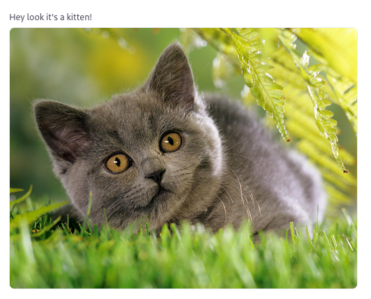

Every component is based on Orchid's Field component therefore you can freely use any common methods for every of them, e.g. `title()`

```php
Avatar::make()
    ->title('Hey look it\'s a kitten!'),
```



## Components

- [Image](/orchid-image-components/usage/image)
- [Avatar](/orchid-image-components/usage/avatar)
- [Gallery](/orchid-image-components/usage/gallery)
- [Lightbox](/orchid-image-components/usage/lightbox)
- [Carousel](/orchid-image-components/usage/carousel)
